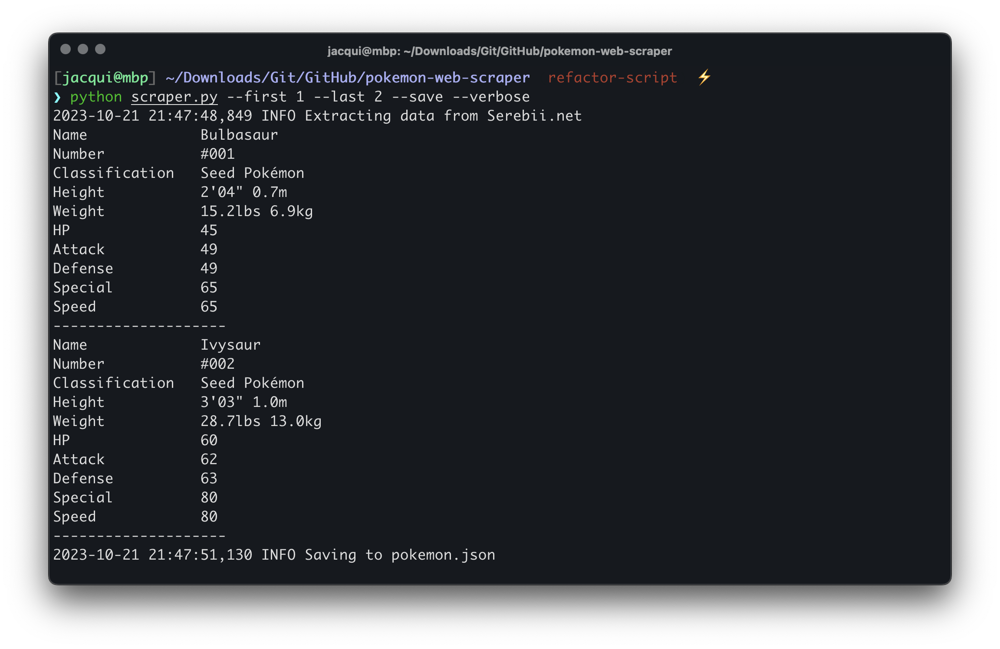

# Pokémon Web Scraper

A little Python CLI application that scrapes Serebii.net. Mostly made for my [Vue Pokédex](https://github.com/shadforth/vue-pokedex) project.



## Getting started

### Prerequisites

- Python
- pip

### Installation

Install the required Python packages by navigating to the project's root directory and running the following command.

```bash
# Install requirements
pip install -r requirements.txt
```

### Usage

In terminal, run the following command. By default, this will only retrieve Bulbasaur.

```bash
# Run the Serebii.net scraper
python scraper.py
```

Some useful commands are listed below.

```bash
# Help on running the script
python scraper.py --help

# Specify which Pokémon to retrieve (1-10)
python scraper.py --first 1 --last 10

# Save output to a JSON file with the `--save` flag
python scraper.py --first 1 --last 10 --save

# View the retrieved web output in console
python scraper.py --verbose
```

## Sample JSON output

Output JSON file when using the `--save` flag.

```json
[
  {
    "name": "Bulbasaur",
    "number": "#001",
    "classification": "Seed Pok\u00e9mon",
    "height": ["2'04\"", "0.7m"],
    "weight": ["15.2lbs", "6.9kg"],
    "hit_points": 45,
    "attack": 49,
    "defense": 49,
    "special": 65,
    "speed": 45
  }
]
```
